# 👋 Hi there! I'm Gourab Chakraborty

<div align="center">
  
</div>

<div align="center">
  
  
  
</div>

<br>

<div align="center">
  
</div>

---

## 🚀 About Me


```yaml
name: Gourab Chakraborty
focus: ["Machine Learning", "Game Development", "Full Stack"]
languages: ["Python", "C++", "JavaScript", "C"]
technologies: ["TensorFlow", "Unity", "Docker", "OpenCV"]
current_focus: "AI/ML Innovation & Game Development"
fun_fact: "I turn coffee into code and ideas into reality! ☕"
motto: "Code with passion, learn with purpose"
```

---

## 📊 GitHub Analytics

<div align="center">
  <!-- GitHub Statistics Row -->
  
  
</div>

<br>

<div align="center">
  <!-- GitHub Streak -->
  
  
</div>

<div align="center">
   
  <span style="color:#58A6FF; font-weight: bold;">Streak is Blazing!</span> 
  
</div>

---

## 🛠️ Tech Arsenal

<div align="center">

### 💻 **Programming Languages**


### 🤖 **AI/ML & Data Science**


### 🎮 **Game Development**


### 🗄️ **Databases & DevOps**


### 🎨 **Design & Modeling**


### ⚡ **Hardware & IoT**


</div>

---

## 🏆 Achievements & Recognition

<div align="center">
  
</div>

---

## 📈 Contribution Journey

<div align="center">
  
</div>

<div align="center">
  
</div>

---

## 🎯 Current Focus & Goals

```mermaid
graph LR
    A[🔬 AI Research] --> B[ 👁️ Vision AI]
    B --> C[🚀 Innovation]
    C --> D[🌍 Impact]
    
    E[📚 Learning] --> F[🛠️ Building]
    F --> G[📖 Teaching]
    G --> H[🤝 Contributing]
    
    style A fill:#58a6ff,color:#0d1117
    style B fill:#ffa500,color:#0d1117
    style C fill:#7c3aed,color:#ffffff
    style D fill:#10b981,color:#0d1117
    style E fill:#58a6ff,color:#0d1117
    style F fill:#ffa500,color:#0d1117
    style G fill:#7c3aed,color:#ffffff
    style H fill:#10b981,color:#0d1117
```

<div align="center">



</div>

**🎯 2025-2026 Objectives:**
- 🤖 Advanced AI/ML model development
- 🌐 Open source community leadership
- 📚 Knowledge sharing through content creation

---

## 📱 Connect & Collaborate

<div align="center">

### 🤝 **Let's Build Something Amazing Together!**

<a href="https://www.linkedin.com/in/thisisgourab/" target="_blank">
  
</a>
<a href="mailto:gourabedu04@gmail.com" target="_blank">
  
</a>

<a href="https://www.youtube.com/@GourabsPixelPath/videos" target="_blank">
  
</a>
<div align="center">


| 📧 **Contact** | 🔗 **Link** | 🎯 **Purpose** |
|:---:|:---:|:---:|
| Professional | [LinkedIn](https://www.linkedin.com/in/thisisgourab/) | Networking & Collaboration |
| Direct | gourabedu04@gmail.com | Project Discussions |
| Content | [Gourab's Pixel Path](https://www.youtube.com/@GourabsPixelPath/videos) | Learning & Tutorials |

</div>

### 💡 **Open to:**
 🤝 **Collaboration** on innovative projects
 💼 **Opportunities** in AI/ML and Game Development  
 🎓 **Mentorship** and knowledge sharing
🚀 **Open Source** contributions

</div>

---

<div align="center">
  
</div>

<div align="center">
  
</div>

<div align="center">
   
  <br>
  <strong style="color:#58A6FF;">Happy Coding! Let's innovate together! 🚀</strong>
  <br><br>
  <em style="color:#C9D1D9;">💝 I love connecting with fellow developers and creators - feel free to reach out!</em>
</div>
